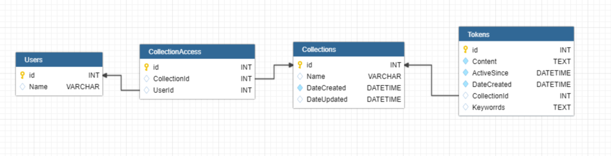

# Database scheme

[See scheme here](https://app.dbdesigner.id/?action=open&uuid=a05e91f1-e83f-439a-96b9-d32ba71a4d54)




## Create script (myslq)

```
CREATE TABLE IF NOT EXISTS `Collections` (
   `id` INT NOT NULL AUTO_INCREMENT,
   `Name` VARCHAR,
   `DateCreated` DATETIME NOT NULL,
   `DateUpdated` DATETIME,
   PRIMARY KEY (`id`)
);

CREATE TABLE IF NOT EXISTS `Tokens` (
   `id` INT NOT NULL,
   `Content` TEXT NOT NULL,
   `ActiveSince` DATETIME NOT NULL DEFAULT 'CURRENT_TIMESTAMP()',
   `DateCreated` DATETIME NOT NULL,
   `CollectionId` INT,
   `Keyworrds` TEXT,
   PRIMARY KEY (`id`)
);

CREATE TABLE IF NOT EXISTS `Users` (
   `id` INT AUTO_INCREMENT,
   `Name` VARCHAR,
   PRIMARY KEY (`id`)
);

CREATE TABLE IF NOT EXISTS `CollectionAccess` (
   `id` INT AUTO_INCREMENT,
   `CollectionId` INT,
   `UserId` INT,
   PRIMARY KEY (`id`)
);

ALTER TABLE `Tokens` ADD CONSTRAINT `Tokens_fk_0_CollectionId` FOREIGN KEY (CollectionId) REFERENCES `Collections`(`id`) ;
ALTER TABLE `CollectionAccess` ADD CONSTRAINT `CollectionAccess_fk_0_CollectionId` FOREIGN KEY (CollectionId) REFERENCES `Collections`(`id`) ;
ALTER TABLE `CollectionAccess` ADD CONSTRAINT `CollectionAccess_fk_0_UserId` FOREIGN KEY (UserId) REFERENCES `Users`(`id`) ;


```