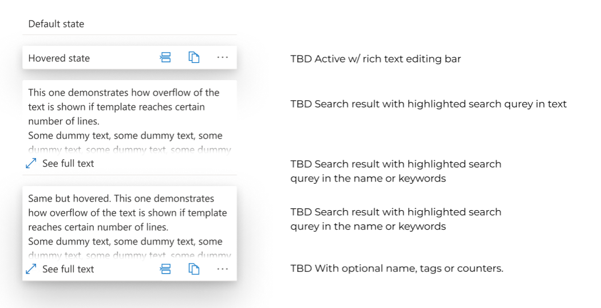

## TextTemplateListItem Control

Control represents text template in the list of templates.

The control is rather complex with a a lot of states (default, hoverred) and few components, including hover menus, overflow bar, rich text bar. Plus, in vNext component will have additional data points and will be customizable. E.g. user will be able to select which additional data to display, e.g:
*  template name, 
* tags, 
* char/word counters. 

On top of that then seaching the search term occurrence in the text, name of tags should be highlighted.

